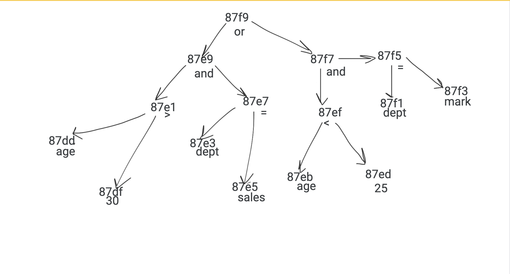
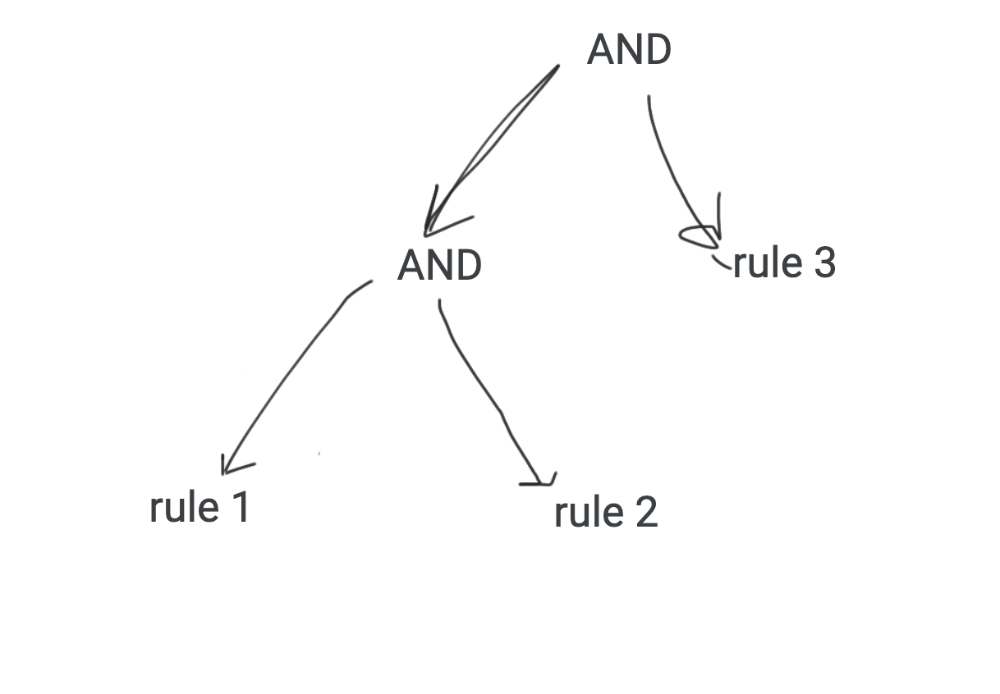

# Rule Engine with AST


## Objective

A simple 3-tier rule engine application (Simple UI, API, and Backend, Data) to determine user eligibility based on attributes like age, department, income, spend, etc. The system uses an Abstract Syntax Tree (AST) to represent conditional rules, allowing for dynamic creation, combination, and modification of these rules.

## Data Structure

A data structure to represent the AST. The data structure should allow rule changes. One possible data structure is a `Node` with the following fields:

- **type**: String indicating the node type ("operator" for AND/OR, "operand" for conditions)
- **left**: Reference to another Node (left child)
- **right**: Reference to another Node (right child for operators)
- **value**: Optional value for operand nodes (e.g., number for comparisons)

## Data Storage

The choice of database for storing the above rules and application metadata. MongoDB is a suitable choice for its flexibility and JSON-like documents.

### Schema Example

**Rule Schema**:
```json
{
  "rule_name": "string",
  "rule": "string",
  "postfixExpr":"string",
  "AST": "object"
}
```

##API Design

## 1.create_rule(rule_string) 

-This function takes a string representing a rule (as shown in the examples) and returns a Node object representing the corresponding AST. The Shunting Yard algorithm is used to convert the rule string into a postfix expression, which is then used to construct the AST.


### 2. `combine_rules(rules)`
This function takes a list of rule strings and combines them into a single AST. The function concatenates the rules using the AND operator to form a combined rule. The combined rule is then converted into an AST and returned as the root node of the combined AST.

```javascript
function combine_rules(rules) {
  // Concatenate all rules using the AND operator
  const combinedRuleString = rules.join(' AND ');

  // Convert the combined rule string to AST
  return create_rule(combinedRuleString);
}
```


## 3. AST Evaluation Controller

This controller provides functionality to evaluate rules stored in MongoDB using an Abstract Syntax Tree (AST). It includes methods to reconstruct the AST from node IDs in MongoDB (`reconstructAST`), evaluate the AST against a set of conditions (`evaluateAST`), and handle HTTP requests for rule evaluation (`evaluateRule`). The `evaluateRule` function retrieves a rule by name, reconstructs its AST, evaluates it based on provided conditions, and returns the result. Error handling is implemented to return appropriate HTTP status codes and log errors to the console. Ensure MongoDB models for `Node` and `Rule` are defined and connected in your application.


## cloning repo

```bash
git clone https://github.com/your-repo/repository.git
```

## Backend Setup

To set up the backend for the rule engine application, follow these steps:

   ```bash
   cd repository/backend
   npm i
   node index.js
   ```
don't forget to add ur MONGO_URL


## frontend Setup

To set up the frontend for the rule engine application, follow these steps:

   ```bash
   cd repository/frontend
   npm i
   node start
   ```

  ## Hosting
 -Backend: Hosted on Render
-Frontend: Hosted on Netlify


